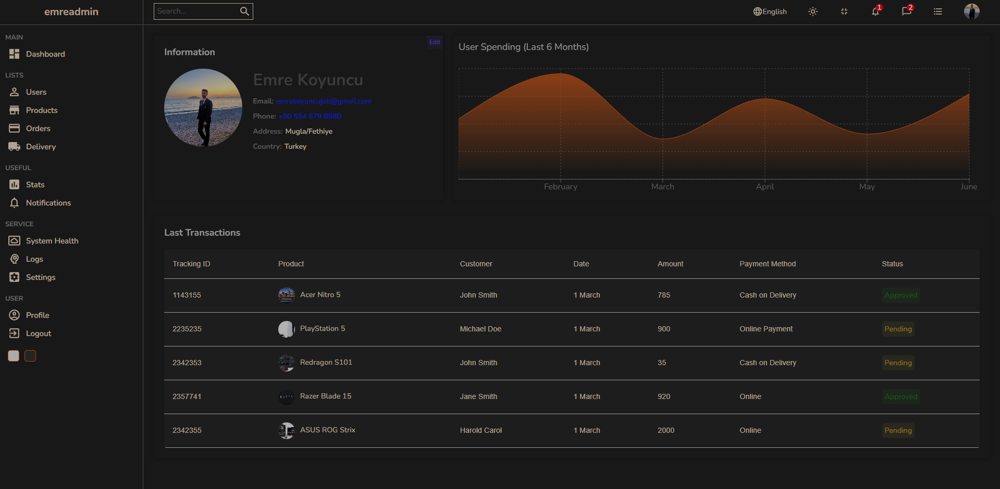

  <h1 align="center">Admin Panel Demo</h1>

  

    A responsive admin panel demo built with React.js
     
    
     
     
    <a href="https://github.com/emrekoyuncuu/AdminPanelDemo/issues">Report Bug</a>
    ·
    <a href="https://github.com/emrekoyuncuu/AdminPanelDemo/issues">Request Feature</a>
  

  

    
    
    
    
  

 

## 📋 Table of Contents

- [About The Project](#-about-the-project)
  - [Key Features](#key-features)
- [Built With](#️-built-with)
- [Getting Started](#-getting-started)
- [Usage](#-usage)
- [Roadmap](#️-roadmap)
- [Contributing](#-contributing)
- [Contact](#-contact)
- [Acknowledgements](#-acknowledgements)

## 🚀 About The Project

  
  
<em>Dashboard Overview</em>

  
  
  
<em>User Profile Overview</em>

Admin Panel Demo is a responsive web application showcasing a modern admin interface. Built with React.js, it demonstrates the implementation of various UI components, data visualization, and responsive design principles. This project serves as a template for creating efficient and user-friendly admin dashboards.

### Key Features

- 📊 **Interactive Dashboard**: Displays key metrics and data visualizations
- 📱 **Responsive Design**: Optimized for both desktop and mobile devices
- 📈 **Data Visualization**: Utilizes Chart.js for creating dynamic charts
- 🎨 **Customizable UI**: Easy-to-modify components for different admin panel needs
- 🔄 **State Management**: Efficient data handling and component updates
- 🌓 **Dark/Light Mode**: Toggle between themes for user comfort

## 🛠️ Built With

This project is created using these technologies:

- [React.js](https://reactjs.org/)
- [JavaScript](https://developer.mozilla.org/en-US/docs/Web/JavaScript)
- [CSS3](https://developer.mozilla.org/en-US/docs/Web/CSS)
- [Chart.js](https://www.chartjs.org/)

## 🏁 Getting Started

To get a local copy up and running, follow these simple steps:

1. Clone the repository
   ``sh
   git clone https://github.com/emrekoyuncuu/AdminPanelDemo.git
   ``
2. Navigate to the project directory
   ``sh
   cd AdminPanelDemo
   ``
3. Install dependencies
   ``sh
   npm install
   ``
4. Start the development server
   ``sh
   npm start
   ``
5. Open [http://localhost:3000](http://localhost:3000) in your browser to see the application

## 💻 Usage

1. Explore the dashboard to view different metrics and charts
2. Navigate through various sections of the admin panel
3. Test the responsiveness by resizing your browser window
4. Customize the components and data to fit your specific admin panel needs

## 🗺️ Roadmap

See the [open issues](https://github.com/emrekoyuncuu/AdminPanelDemo/issues) for a list of proposed features and known issues.

## 🤝 Contributing

Contributions are what make the open-source community such an amazing place to learn, inspire, and create. Any contributions you make are **greatly appreciated**.

1. Fork the Project
2. Create your Feature Branch (`git checkout -b feature/AmazingFeature`)
3. Commit your Changes (`git commit -m 'Add some AmazingFeature'`)
4. Push to the Branch (`git push origin feature/AmazingFeature`)
5. Open a Pull Request

## 📧 Contact

Emre Koyuncu - [LinkedIn](https://www.linkedin.com/in/emrekoyuncuu/) - emrekoyuncujob@gmail.com

Project Link: [https://github.com/emrekoyuncuu/AdminPanelDemo](https://github.com/emrekoyuncuu/AdminPanelDemo)

## 🙏 Acknowledgements

- [React.js Documentation](https://reactjs.org/docs/getting-started.html)
- [Chart.js Documentation](https://www.chartjs.org/docs/latest/)
- [Font Awesome](https://fontawesome.com)
- [React Icons](https://react-icons.github.io/react-icons/)
- [Img Shields](https://shields.io)

  Made with ❤️ by <a href="https://github.com/emrekoyuncuu">Emre Koyuncu</a>

